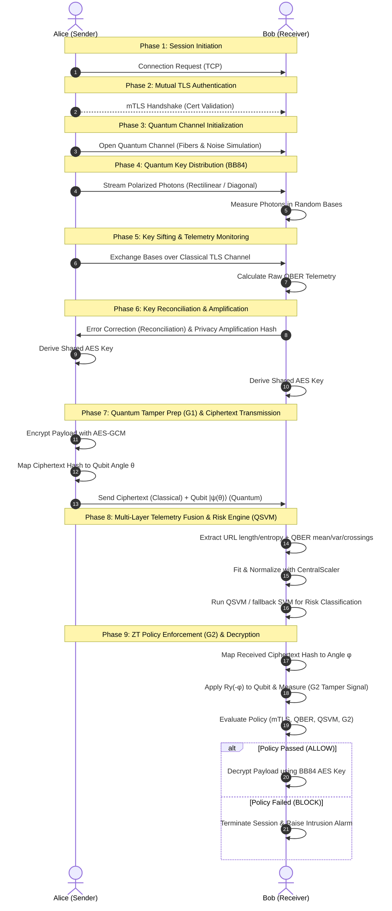

# Project Architecture and Conceptual Guide

Welcome to the **Quantum-Secure Zero-Trust Network (QZTN) Simulation** repository. This document serves as a comprehensive developer onboarding guide, detailing the conceptual framework, the 9-phase protocol lifecycle, and a complete file-by-file breakdown of the system.

---

## 1. Conceptual Framework & Rationale

Modern network security architectures suffer from major blind spots:
1. **Lacks Physical-Layer Observability**: Classical intrusion detection systems (IDS) operate at L3–L7 (IP/TCP and application payload analysis). They cannot detect if raw physical signals (e.g. optical signals in fiber) are being tapped or intercepted in transit.
2. **Key Distribution Vulnerability**: Traditional key exchange protocols (Diffie-Hellman, RSA) rely on computational complexity assumptions that are vulnerable to quantum attackers running Shor's algorithm.
3. **Decoupled Cryptographic Verification**: In standard designs, payload authentication (e.g., HMAC, AES-GCM) is handled entirely in software. A certificate compromise or classical TLS stack bug can lead to silent failure.

This project implements a **hybrid quantum-classical zero-trust network** designed to solve these issues by combining:
- **Quantum Key Distribution (QKD)**: BB84 protocol simulation to negotiate information-theoretically secure symmetric keys.
- **Physical-Layer Telemetry Fusion**: Continuous calculation of the Quantum Bit Error Rate (QBER) at the physical layer, combined with application-layer metadata (URL metrics).
- **Quantum Machine Learning (QSVM)**: A Quantum Support Vector Machine using a $ZZ$ feature map to predict malicious/adversarial risk based on fused telemetry.
- **Probabilistic Quantum Tamper Signaling (G1/G2)**: An out-of-band quantum tripwire. It prepares an ancilla quantum state based on the ciphertext hash ($G1$) and verifies it at the receiver ($G2$), revealing whether classical payload manipulation occurred.
- **Adaptive Policy Enforcement**: A zero-trust controller that dynamically blocks or allows payload decryption based on authentication state, QBER anomalies, G2 tripwire status, and QSVM risk scores.

### Why Hybrid?
* **Defense in Depth**: Classical authenticated encryption (AES-GCM) provides the actual mathematical integrity and confidentiality guarantee for the ciphertext. The quantum layer ($G2$ tamper signaling) provides an *independent, out-of-band physical tripwire*.
* **Domain Separation**: A compromise in the software layer (e.g. leaked TLS private keys) does not compromise the quantum channel sifting telemetry or the physical key negotiation.

---

## 2. The 9-Phase Zero-Trust Lifecycle

The simulation executes communications across nine logical phases, represented visually in the diagram below:

### Protocol Detail:
1. **Phase 1 (Initiation)**: Classical connection established between nodes.
2. **Phase 2 (mTLS)**: Mutual TLS authentication using certificates, confirming peer identity.
3. **Phase 3 (QC Init)**: Initialize the simulation parameters for the quantum channel (length, attenuation, noise factor).
4. **Phase 4 (QKD BB84)**: Alice transmits a stream of single-photon states. Bob measures them.
5. **Phase 5 (Sifting & Telemetry)**: Base sifting occurs. Mismatched bases are discarded. Bob computes QBER telemetry (rolling mean, variance, crossings).
6. **Phase 6 (Reconciliation & Amplification)**: Cascade error correction aligns the keys. SHA-256 hash privacy amplification shrinks the key size to eliminate leakages, yielding a final high-entropy AES key.
7. **Phase 7 (G1 Prep & Classical Send)**: Alice encrypts the payload using AES-GCM. She hashes the ciphertext and rotates a target qubit by angle $\theta = \pi \times \text{hash\_val}$. She sends the ciphertext classically and the rotated qubit state to Bob.
8. **Phase 8 (Telemetry Fusion & QSVM)**: Bob extracts structural URL features and combines them with QBER telemetry. Features are scaled via a central scaler and fed into a Quantum Support Vector Machine (QSVM) using a quantum kernel to classify security risk.
9. **Phase 9 (G2 Enforcement & Decryption)**: Bob computes the expected angle $\phi$ from the received ciphertext. He applies the inverse rotation $R_y(-\phi)$ to Alice's quantum state. If the ciphertext was untampered, the state returns to $|0\rangle$. Measuring $|1\rangle$ indicates an out-of-band tamper signal. The policy engine consolidates all metrics, blocking decryption if an anomaly is detected.

---

## 3. Directory and File-by-File Reference

Below is the file-by-file inventory of the codebase, organized by component.

### 3.1 Network Nodes & Simulation Controllers
* **[simulate.py](simulate.py)**
  * The main entry point for a single session execution.
  * Coordinates Alice and Bob nodes, allows setting command-line overrides (e.g. `--eve` to inject an eavesdropper, `--noise <float>` to adjust channel noise, or a custom `--payload`).
* **[stream_simulation.py](stream_simulation.py)**
  * Spawns a real-time, continuous traffic simulation.
  * Dynamically rolls random channel states (Clean, Noisy, Eavesdropped) for each request.
  * Computes feature engineering on-the-fly and prints a real-time, color-coded terminal dashboard resembling a Security Operations Center (SOC) monitor.
* **[alice_node.py](alice_node.py)**
  * Implements the sender node's simulation loop.
  * Handles mTLS client connection, BB84 state generation, sifting negotiations, key reconciliation, AES-GCM encryption, and G1 statevector preparation.
* **[bob_node.py](bob_node.py)**
  * Implements the receiver node's server loop.
  * Measures quantum states, coordinates key sifting, monitors QBER metrics, executes feature engineering, runs the ML/QSVM risk engine, measures G2 tamper status, runs the ZT policy enforcer, and saves structured JSON logs.

### 3.2 Core Logic Module (`src/`)
The `src/` directory contains the foundational libraries supporting the zero-trust pipeline.

#### Authentication (`src/auth/`)
* **[tls_client.py](src/auth/tls_client.py)**: A wrapper configuring Python's `ssl` library to establish mutual TLS (mTLS) client sockets requiring CA and peer validation.
* **[tls_server.py](src/auth/tls_server.py)**: Configures `ssl` for a secure mTLS server socket that validates client certificates.

#### Cryptography (`src/crypto/`)
* **[aes_gcm.py](src/crypto/aes_gcm.py)**: Handles encryption and decryption using AES-256 in GCM mode (Galois/Counter Mode), guaranteeing payload confidentiality and cryptographic authenticity.

#### Infrastructure (`src/infrastructure/`)
* **[channel.py](src/infrastructure/channel.py)**: Simulates the physical transmission channels (the classical TCP sockets and the simulated quantum fiber channel).
* **[noise.py](src/infrastructure/noise.py)**: Implements depolarization and bit-flip noise models for the quantum channel.
* **[config.py](src/infrastructure/config.py)**: Handles configuration parameters, constants, and logging paths.
* **[logger.py](src/infrastructure/logger.py)**: Structured logging utilities (including `log_structured_event` using JSON schema) for auditability.

#### Quantum Integrity signaling (`src/integrity/`)
* **[g1_sender.py](src/integrity/g1_sender.py)**: Hashes the ciphertext, maps it to a rotation angle, and returns a single-qubit quantum state vector.
* **[g2_receiver.py](src/integrity/g2_receiver.py)**: Applies the inverse rotation to the received qubit and performs a computational basis measurement. Yields `tamper_anomaly` (boolean) and `tamper_signal` (string state representation).

#### Machine Learning Risk Engine (`src/ml/`)
* **[qsvm.py](src/ml/qsvm.py)**: Defines the Quantum Support Vector Classifier architecture using `qiskit_machine_learning` kernels and a `ZZFeatureMap`.
* **[feature_vector.py](src/ml/feature_vector.py)**: Implements the `CentralScaler` class. It manages fit parameters, scales features centrally, and acts as the source-of-truth for normalization parameters across dataset generation, training, and execution.
* **[feature_engineering.py](src/ml/feature_engineering.py)**: Contains methods to compute URL structural properties (length, character entropy) and statistical QBER metrics.
* **[model_loader.py](src/ml/model_loader.py)**: Loads trained QSVM weights from `models/qsvm_weights.npy`. If weights are missing, it automatically trains and loads a classical `ClassicalFallbackClassifier` (RBF SVM) on-the-fly to guarantee zero downtime.
* **[dataset.py](src/ml/dataset.py)**: PyTorch and Qiskit dataset wrapper classes.
* **[train.py](src/ml/train.py)**: Training script that preprocesses features, executes QSVM fitting, and outputs the model weights file.

#### Policy Enforcement (`src/policy/`)
* **[enforcer.py](src/policy/enforcer.py)**: The Zero-Trust Policy Engine. It evaluates classical/quantum inputs (`tls_authenticated`, `qber_check`, `ml_risk`, `g2_tamper`) against adaptive thresholds to output an authorization verdict.

#### Quantum Key Distribution (`src/qkd/`)
* **[alice.py](src/qkd/alice.py)**: Handles quantum state preparation for BB84.
* **[bob.py](src/qkd/bob.py)**: Handles basis selection and measurements for BB84.
* **[sifting.py](src/qkd/sifting.py)**: Negotiates which key elements to retain based on base matching.
* **[reconciliation.py](src/qkd/reconciliation.py)**: Corrects transmission bit-flips (error reconciliation).
* **[privacy_amplification.py](src/qkd/privacy_amplification.py)**: Shrinks the reconciled key into a secure, final AES key.

#### Legacy Telemetry Wrapper (`src/telemetry/`)
* **[feature_vector.py](src/telemetry/feature_vector.py)**: Relic of the legacy code. It throws a deprecation warning and delegates directly to the central scaler in `src.ml.feature_vector`.
* **[qber_monitor.py](src/telemetry/qber_monitor.py)**: Calculates statistical properties of the QBER over the transmission timeline (mean, variance, and crossing rate above thresholds).

### 3.3 Dataset & Certs Generators
* **[data/generate_dataset.py](data/generate_dataset.py)**
  * Creates a synthetic URL database, computes structural metrics, and simulates various QBER noise profiles.
  * Fits the `CentralScaler` parameters, scales the dataset, and saves training files alongside a `dataset_manifest.json`.
* **[scripts/gen_certs.sh](scripts/gen_certs.sh)**
  * Bash script generating self-signed X.509 Certificates using openssl for mutual TLS (Alice, Bob, and CA root).

### 3.4 Evaluation & Plotting Tools
* **[evaluation/ablation.py](evaluation/ablation.py)**
  * Runs the zero-trust system across seven variants (A0–A6), systematically turning off security elements (QKD, mTLS, ML risk engine, G2, etc.) to evaluate overall policy efficacy.
* **[evaluation/compare_classifiers.py](evaluation/compare_classifiers.py)**
  * Runs cross-validation comparing Classical SVM, Random Forest, and QSVM, outputting a comparative performance CSV.
* **[evaluation/compare_trust_models.py](evaluation/compare_trust_models.py)**
  * Monte Carlo simulator evaluating system risk response across different security scenarios.
* **[evaluation/plot_results.py](evaluation/plot_results.py)** & **[evaluation/plot_advanced.py](evaluation/plot_advanced.py)**
  * Generates publication-ready figures representing QBER probability densities, classifier comparisons, ROC curves, ablation scores, and the single-session Zero-Trust timeline.

---

## 4. Key Mathematical Formulations

### 4.1 G2 Quantum Tamper Detection
Alice rotates an ancilla qubit by $\theta$ based on the hash of the ciphertext. Bob applies the inverse rotation based on his received ciphertext:
$$|\psi_{G2}\rangle = R_y(-\phi) R_y(\theta) |0\rangle = R_y(\theta - \phi) |0\rangle$$

If the ciphertext is modified, there is an angular mismatch $\Delta = \theta - \phi$. Measuring the qubit in the computational basis yields a tamper detection probability of:
$$P_{\text{detect}} = \sin^2\left(\frac{\Delta}{2}\right)$$

### 4.2 Multi-Qubit Tripwire Amplification
If $k$ independent ancilla qubits are rotated and checked, the cumulative probability of detecting tampering is amplified:
$$P_{\text{detect, cumulative}} = 1 - \cos^{2k}\left(\frac{\Delta}{2}\right)$$

This allows a highly reliable tripwire even when the angular mismatch $\Delta$ is relatively small.

### 4.3 Feature Representation
The feature space scaled by `CentralScaler` contains five normalized metrics:
$$\vec{x} = [ \text{URL Length}, \text{URL Entropy}, \text{QBER Mean}, \text{QBER Variance}, \text{QBER Crossings} ]$$
These parameters are normalized using fitted means and variances before classification by the QSVM's quantum feature map.

---

## 5. Development Tips

1. **Self-Healing Fallback**: If you want to quickly test changes without waiting for a full QSVM training epoch (which uses Qiskit's CPU statevector simulator and takes a couple of minutes), simply delete or rename `models/qsvm_weights.npy`. The system will automatically fall back to training and running a fast classical RBF SVM.
2. **Central Scaling Rule**: Do not scale feature vectors using manual divisions or local scalers. Always import and use `CentralScaler` from `src.ml.feature_vector` to ensure feature mappings remain consistent across all scripts.
3. **Structured Logs**: When making modifications to network behaviors, verify that events are logged via `log_structured_event`. Raw stdout logs are ignored during automated evaluation.
